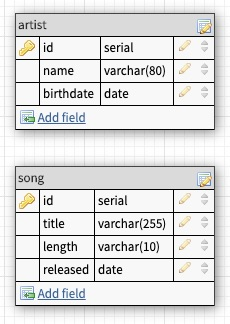

# Get Jazzy AJAX

We've got a request to make an application to track favorite Jazz artists and songs for a local fan club. One of the members is a hobby developer, so they've provided some starter code for us, but they aren't sure how to write the code to work with a database, so we'll need to add that part.

## Objectives

- Set up a database based on requirements from an ERD
- Connect to the database from an Express server using `pg`
- Write basic SQL statements to read (SELECT), sort (ORDER BY) and create (INSERT) data.

## Getting Started

- Fork & clone the starter code
- Install dependencies (`npm install`)
- Start the app (`npm start`)
- Check out the demo app at http://localhost:5000
- Look through the code that has been provided to you!

## Base Requirements

### Database Setup

The fan club does have an idea of what data they want to store, as you can see in the demo app they provided. They also gave us a simple ERD to reference.

> An ERD is an Entity Relationship Diagram. Basically it's an illustration of the tables and data that should be in a database, and any relationships between them.

From this ERD, we can see that we'll need to setup 2 tables: artist & song. We can also see what columns they expect those tables to have, as well as what data types we should use for each.

Using the ERD above:

- [x] Create a new database called `jazzy_sql` using Postico.
- [x] Write the SQL to create both of the tables (Note: Make sure to use the table names show.)
- [x] Write INSERT statements to add the sample data provided in the `server.js` file.
- [x] Create the tables and insert the test data using Postico.
- [x] Add the SQL to the `database.sql` file. This file will help others interested in this project, get it setup correctly if they pick it up from GitHub.

### Update the Server-side Code

- [x] Install `pg` and setup your `pool` to connect to the database.
- [x] Update the `\artist` GET route to get data from the database. Sort the data by birthdate, youngest to oldest.
- [ ] Update the `\artist` POST route to store data in the database.
- [ ] Update the `\song` GET route to get data from the database. Sort the data by title.
- [ ] Update the `\song` POST route to store data in the database.

> NOTE: You should only need to modify server side code if you've named things correctly. You can continue to the existing client code for testing.

## Stretch

- [ ] Move the `pool` configuration out of `server.js` and into a `pool.js` module file.
- [ ] Move the `\artist` routes to an artist router file.
- [ ] Move the `\song` routes to a song router file.
